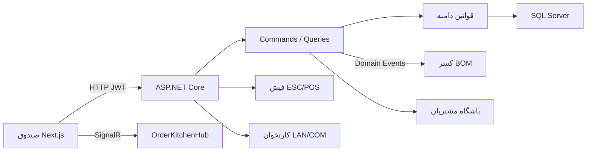

# مستندات جامع سیستم ToastIran POS

**محصول:** ToastIran POS (Pnara)  
**نسخه سند:** ۱.۰  
**مخاطب:** معمار سیستم، راهبر فنی، مدیر فروشگاه، و تیم استقرار سخت‌افزار

این سند معماری، جریان کسب‌وکار، موتور انبار/رسپی، مسیر ثبت سفارش تا فیش دوتایی، و راهنمای نصب را به‌زبان فنی و روان فارسی پوشش می‌دهد.

---

## ۱. معماری کلی سیستم

ToastIran POS یک اکوسیستم صندوق لمسی و انبار رستوران/کافه است که برای بازار ایران طراحی شده: مبلغ‌ها در **ریال** ذخیره و در UI به **تومان** نمایش داده می‌شوند، تقویم **جلالی** است، و لایه پرداخت با کارتخوان‌های **PC-POS** ایرانی (آسان‌پرداخت، سامان کیش/SEP، به‌پرداخت ملت) حرف می‌زند.

### ۱.۱ لایه‌های Clean Architecture

| لایه | پروژه | مسئولیت |
| --- | --- | --- |
| Domain | `backend/src/Domain` | موجودیت‌ها، Value Object (پول و موبایل)، رویدادهای دامنه، موتور قیمت‌گذاری، قوانین چرخه سفارش |
| Application | `backend/src/Application` | CQRS با MediatR، Validatorها، DTO، قرارداد سرویس‌ها |
| Infrastructure | `backend/src/Infrastructure` | EF Core / SQL Server، Identity، حسابرسی، پل PC-POS، دیسپچر ESC/POS |
| API | `backend/src/API` | کنترلرها، JWT، Swagger، Middleware خطا، هاب SignalR |
| Frontend | `frontend` | Next.js App Router، صندوق لمسی، KDS، پنل مدیریت |

وابستگی فقط به سمت داخل است: Frontend → API → Infrastructure → Application → Domain.

### ۱.۲ جریان داده با CQRS

هر عمل کاربری یک **Command** یا **Query** است:

- ثبت پیش‌نویس، افزودن آیتم، ارسال به آشپزخانه، تسویه نقد/کارتخوان → Command
- منو، موجودی، گزارش ساعات پیک، باشگاه مشتریان → Query

پس از `SaveChanges`، رویدادهای دامنه (`OrderSubmitted`، `OrderPaid`، `OrderCancelled`) از طریق MediatR پخش می‌شوند. هندلر ارسال سفارش موجودی را طبق BOM کم می‌کند؛ هندلر پرداخت، باشگاه مشتریان را به‌روز می‌کند؛ لغو سفارش کسر را برمی‌گرداند.



### ۱.۳ ارتباط فرانت‌اند و بک‌اند

- **REST:** مسیرهای `/api/*` از طریق `rewrites` در Next.js به `http://localhost:5088` پروکسی می‌شوند تا در توسعه با CORS درگیر نشوید.
- **احراز هویت:** JWT Bearer + Refresh Token. مجوزهای دانه‌دانه (`Menu.Manage`، `Orders.CancelDraft`، `Payments.Settle` و ...) هم در Claim و هم به‌صورت Policy سمت API اعمال می‌شوند.
- **حالت آفلاین صندوق:** سبد در Zustand + `localStorage` نگه داشته می‌شود. «ثبت موقت» سبد را با سرور همگام می‌کند؛ «حذف نیمه‌کاره» پیش‌نویس را Hard Delete می‌کند تا داده یتیم نماند.
- **زمان واقعی:** کلاینت `@microsoft/signalr` به `/hubs/kitchen` وصل می‌شود، گروه `bar` یا `kitchen` را Join می‌کند و رویدادهای `OrderUpdated` / `KitchenTicket` / `BarTicket` را با هشدار صوتی پخش می‌کند.
- **تم پویا:** رنگ Primary/Secondary تنظیمات فروشگاه به متغیرهای CSS (`--primary`، `--secondary`) تبدیل می‌شود و کل UI فوری عوض می‌شود.

مسیرهای اصلی UI:

| مسیر | نقش |
| --- | --- |
| `/pos` | صندوق لمسی Toast-style |
| `/kds` | نمایشگر باریستا |
| `/kds/kitchen` | نمایشگر آشپزخانه |
| `/admin/menu` | سازنده منو و BOM |
| `/admin/inventory` | انبار و نقطه سفارش |
| `/admin/customers` | باشگاه مشتریان |
| `/admin/reports` | نمودارهای Recharts |
| `/admin/settings` | برندینگ و تم |

---

## ۲. مکانیزم فرمولاسیون و انبار (BOM Engine)

### ۲.۱ مدل داده

هر `MenuItem` یا `MenuItemModifier` می‌تواند یک `Recipe` داشته باشد. رسپی مجموعه‌ای از `RecipeLine` است:

- ماده خام: `InventoryItem` (SKU، واحد Kg/Gr/Liter/Ml/Count)
- مقدار استاندارد مصرف برای **یک واحد فروش**
- نقطه سفارش مجدد (`ReorderPoint`) و موجودی ایمنی (`SafetyStock`)

نمونه: لاته = ۱۸ گرم دانه اسپرسو + ۱۸۰ میلی‌لیتر شیر.

### ۲.۲ اتصال در پنل مدیریت

در `/admin/menu` محصول را می‌سازید، افزودنی (شیر بادام، شات اضافه، بدون شکر) تعریف می‌کنید، سپس ماده اولیه را با مقدار مصرف به BOM گره می‌زنید. اولویت دسته‌ها با دکمه‌های جابه‌جایی ذخیره می‌شود و همان `DisplayPriority` در تب‌های صندوق دیده می‌شود.

### ۲.۳ کسر خودکار

1. صندوق‌دار سفارش را **ارسال به بار/آشپزخانه** می‌کند (`Submit`).
2. دامنه وضعیت را `Submitted` می‌کند و `OrderSubmittedEvent` را بالا می‌آورد.
3. هندلر موجودی، برای هر خط فاکتور رسپی آیتم و رسپی افزودنی‌ها را می‌خواند و `CurrentStock` را به اندازه `مقدار × تعداد` کم می‌کند.
4. تراکنش از نوع `RecipeDeduction` در گردش انبار ثبت می‌شود.
5. اگر موجودی به نقطه سفارش برسد، رویداد کمبود و نشان «نزدیک اتمام» در گرید صندوق ظاهر می‌شود.

لغو سفارش ارسال‌شده، کسر را با `ReverseDeduction` برمی‌گرداند. پیش‌نویس هرگز انبار را لمس نمی‌کند.

ورود کالا (فاکتور خرید) میانگین موزون قیمت را به‌روز می‌کند؛ ضایعات موجودی را کم می‌کند بدون فروش.

---

## ۳. جریان ثبت سفارش، پرداخت و پرینت دوفیشی

راهنمای گام‌به‌گام صندوق `/pos`:

1. **ورود پرسنل** با JWT. هدر صندوق نام فروشگاه، نام اپراتور، ساعت شمسی زنده و نشان اتصال POS را نشان می‌دهد.
2. **نوع سفارش** را انتخاب کنید: حضوری، بیرون‌بر یا بار. در حضوری شماره میز را وارد کنید.
3. از **تب دسته‌ها** یا جستجوی نام/SKU ماده، محصول را لمس کنید.
4. **کشو افزودنی** باز می‌شود: شات اضافه، شیر گیاهی، بدون شکر، تعداد و یادداشت آماده‌سازی. پیشنهادهای همان دسته کنار صفحه است.
5. **صورتحساب زنده** سمت راست فوراً جزء، افزودنی، تخفیف، ارزش افزوده و مبلغ نهایی را به تومان نشان می‌دهد.
6. موبایل مشتری را وارد کنید. اگر در باشگاه باشد نشان «مشتری وفادار — N سفارش قبلی» می‌آید؛ در غیر این صورت هنگام تسویه upsert می‌شود.
7. **ثبت موقت:** پیش‌نویس روی سرور ذخیره می‌شود و با رفرش مرورگر از بین نمی‌رود.
8. **حذف فاکتور نیمه‌کاره:** پیش‌نویس Hard Delete می‌شود؛ چیزی در دیتابیس نمی‌ماند.
9. **ارسال به بار/آشپزخانه:** سفارش Submit می‌شود، BOM کسر می‌گردد، فیش آماده‌سازی چاپ/دیسپچ می‌شود و KDS با صدا بلیت را می‌گیرد.
10. **تسویه:** نقد (با محاسبه بقیه)، کارت‌به‌کارت (شماره پیگیری)، یا کارتخوان.
11. برای کارتخوان: دستگاه را انتخاب کنید، «ارسال مبلغ به دستگاه کارتخوان» را بزنید. مودال انتظار تا ۴۵ ثانیه Poll می‌کند؛ در Settled فاکتور Paid می‌شود.
12. **پرینت دوفیشی:** مرورگر فیش مشتری (لوگو، شماره، تاریخ شمسی، جدول اقلام، ارزش افزوده، پاورقی) و فیش بار/آشپزخانه (فونت درشت، میز، زمان سپری‌شده، بولت افزودنی‌ها) را جداگانه روی ۸۰mm یا ۵۸mm می‌فرستد. همزمان API بک‌اند ESC/POS را به پرینتر شبکه/USB می‌دهد.

ایستگاه فیش از روی `TicketStation` آیتم مشخص می‌شود: بار، آشپزخانه، یا هر دو.

---

## ۴. راهنمای نصب، کانفیگ سخت‌افزار و استقرار

### ۴.۱ پیش‌نیازها

- .NET 8 SDK و SQL Server (LocalDB یا Docker)
- Node.js 18+ برای فرانت‌اند
- پرینتر حرارتی ESC/POS (پورت ۹۱۰۰ شبکه یا USB/queue مرورگر)
- کارتخوان PC-POS با پروتکل LAN یا COM

### ۴.۲ راه‌اندازی بک‌اند

```bash
cd RestoPOS/backend
# رشته اتصال را در src/API/appsettings.json تنظیم کنید
dotnet ef database update --project src/Infrastructure --startup-project src/API
dotnet run --project src/API
```

Swagger: `http://localhost:5088/swagger`  
حساب اولیه توسعه: `admin` / `Admin@12345` — در تولید حتماً عوض شود.

Seed یک فروشگاه نمونه، دسته قهوه، لاته با BOM، موجودی دانه/شیر و کارتخوان «صندوق ۱» می‌سازد.

### ۴.۳ راه‌اندازی فرانت‌اند

```bash
cd RestoPOS/frontend
npm install
# در صورت نیاز API_PROXY_TARGET را در .env.local تغییر دهید
npm run dev
```

آدرس صندوق: `http://localhost:3000/pos`

### ۴.۴ پرینتر حرارتی

**الف) چاپ مرورگر (USB / درایور ویندوز)**  
در مودال تسویه عرض ۸۰mm یا ۵۸mm را انتخاب کنید. قالب‌ها در `frontend/src/components/print/` با CSS مخصوص رول حرارتی هستند. در تنظیمات چاپ مرورگر، حاشیه‌ها را صفر و مقیاس را ۱۰۰٪ بگذارید و پرینتر حرارتی را پیش‌فرض کنید.

**ب) ESC/POS شبکه**  
در `/admin/settings` فیلد «آدرس پرینتر حرارتی» را IP پرینتر بگذارید (پورت پیش‌فرض ۹۱۰۰). بک‌اند بایت‌های ESC/POS را می‌فرستد و اگر شبکه قطع باشد، فایل تشخیصی در پوشه `tickets/` ذخیره می‌شود.

اتصال USB مستقیم به سرویس بک‌اند در نسخه فعلی از مسیر فایل/صف چاپ سیستم‌عامل انجام می‌شود؛ برای کیوسک ویندوز معمولاً ترکیب «چاپ مرورگر + پرینتر پیش‌فرض» پایدارترین گزینه است.

### ۴.۵ کارتخوان‌های ایرانی (PC-POS)

رابط `IPosDeviceService` مبلغ را روی LAN (معمولاً پورت ۱۳۶۲/۱۲۰۰۰) یا COM ارسال می‌کند، شماره Trace/RRN را می‌گیرد و تسویه را تأیید می‌کند.

در Seed یک دستگاه نمونه با PSP سامان‌کیش ساخته می‌شود. فهرست زنده از `GET /api/payments/devices` خوانده می‌شود.

برای اتصال واقعی:

1. کارتخوان و PC صندوق در یک VLAN باشند (یا COM مشخص شود).
2. TerminalId و MerchantId پذیرنده را در رکورد `PosDevices` وارد کنید.
3. در Production، کلاس `LocalPcPosDeviceService` را با SDK رسمی آسان‌پرداخت / SEP / به‌پرداخت جایگزین کنید؛ قرارداد Application عوض نمی‌شود.
4. Timeout کلاینت ۴۵ ثانیه است؛ روی دستگاه هم Timeout فروشنده را هم‌تراز کنید.

### ۴.۶ استقرار پیشنهادی

- API پشت IIS / Kestrel + HTTPS، JWT Key در User Secrets یا Vault
- فرانت‌اند `next build && next start` یا خروجی استاتیک پشت Nginx
- SQL Server با Backup روزانه و دقت `decimal(18,0)` برای ریال
- صندوق‌ها Thin Client لمسی Full-Screen روی `/pos`؛ نمایشگر بار روی `/kds`؛ آشپزخانه روی `/kds/kitchen`

---

*Pnara — ToastIran POS. این سند باید هم‌زمان با تغییر قرارداد API به‌روز شود.*
